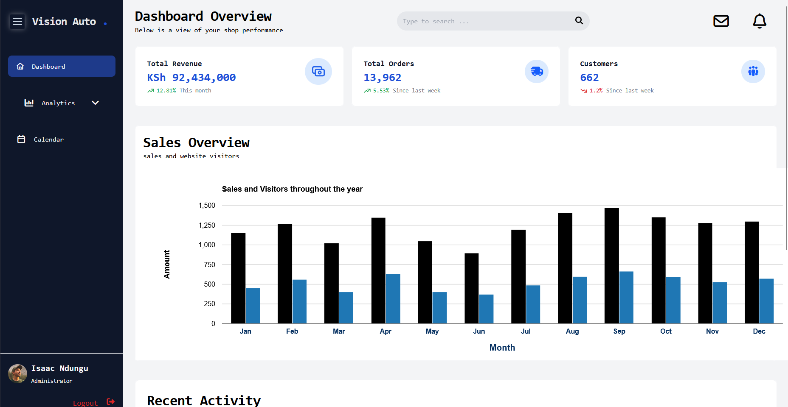
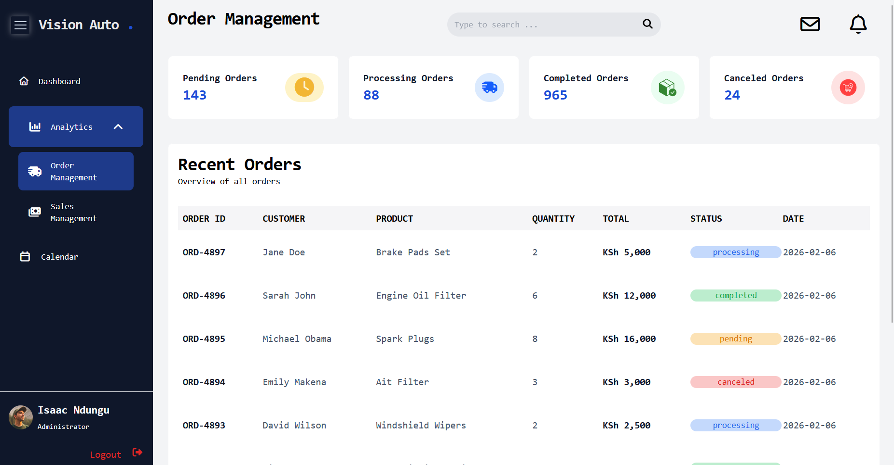
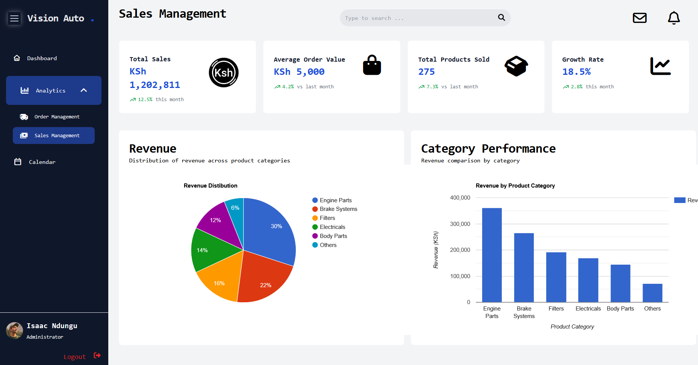
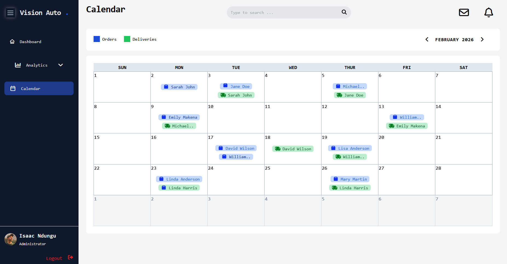

# vision Auto - Admin Dashboard

This project is an admin dashboard for Vision Auto. The project will be built with HTML and Tailwind to showcase an interface for summarizing and managing spare parts sales and orders.

## Contributor 

Isaac Ndungu

## Project Brief

Vision Auto Admin Dashboard is a static administrative interface designed for a spare parts sales company. The dashboard provides a centralized system for monitoring sales performance, managing orders, and reviewing business activity.

The Dashboard interface follows a classic dashboard layout that include  
* A fixed navigation bar,
* A top navigation bar, and
* A main content area for data visualization and tables. 

### Core Features 

1. Dashboard Page (Overview) 
    - The main landing page providing a summary of business perfomance through KPI summary cards, a perfomance chart and recent activity kenya


2. Analytics Page

    Divided into two sections:
    - Order Management - includes orders table and summary cards that display order statuses
    - Sales Management - includes sales summary cards and representations for revenue breakdown. It also includes a ranking for most popular spare parts sold.  
    
3. Calendar Page 
    - Includes a monthly calendar grid layout with highlighted dates for scheduled deliveries and confirmed orders.


## Technologies Used 

* HTML5
* CSS
* Tailwind 
* Google charts 

## Usage Instruction 

1. Clone the repository:
```bash 
git clone git@github.com:isaac-ndungu/vision-auto.git
```
2. Open the project folder.

3. Open index html in any modern browser.


## Business Rationale 
The Vision Auto Admin Dashboard is designed to simulate a real-world internal management system for a spare parts distribution business. 

The dashboard provides an efficient and centralized platform for monitoring various business metrics. The design emphasizes on clarity and usability to ensure that a user can interpret key metrics and act accordingly.


## Screenshots 








## Future Improvements 
- A search and filtering functionality 
- Javascript integration
- backend integration with a database
- Authentication system 